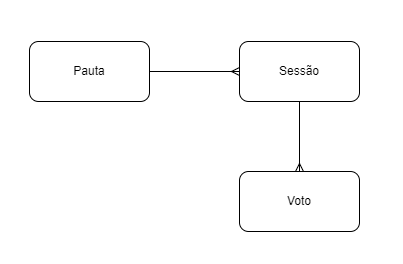

# SICREDI-VOTING

> Projeto de Avaliação para vaga SICREDI através da AVENUE-CODE

## 💻 Pré-requisitos

Para executar você vai precisar dos seguintes requisitos:
* Docker / Docker-Compose configurados e instalados
* Java na versão 11 configurado
* Ferramenta cUrl ou semelhate para teste das API's REST

## 🏡 Descrição da arquitetura

O sistema é composto de quatro módulos:

`sicredi-api-gateway` - Api gateway baseado em Zuul para permitir e facilitar a escalabilidade

`sicredi-eureka-server` - Service discovery baseado no Eureka para funcionar como proxy reverso

`sicredi-resultmq-service` - Serviço simples para desenfileirar mensagens do rabbitmq como teste. Não deverá ser executado se outro serviço de integração estiver disponível 

`sicredi-voting-service` - Serviço principal que é utilizado para criar pautas, abrir sessões e realizar votos. 

	Todas os endpoits recebem um objeto json com os parâmetros de cada entidade.
	Os endpoints disponibilizados foram:
	
	POST http://localhost:8888/voting/pauta/v1 - Cadastra uma nova pauta com titulo e descricao
	
	POST http://localhost:8888/voting/sessao/v1 - Abre uma nova sessão de votação com o tempo de duração definido
	
	POST http://localhost:8888/voting/voto/v1 - Realiza um voto em um sessão criada recebendo o cpf e o id do associado
	
Para exemplos, acesse a documentação do postman abaixo:
https://documenter.getpostman.com/view/2815291/2s8YCaHabi
	
A aplicação utiliza um banco postgres e um servidor rabbitmq.

O versionamento das api's foi definido como sendo da seguinte forma:

http://ip:porta/api/modulo/v1/* (onde v1 é a versão inicial e qualquer modificação estrutural entraria como v2).

## 🧩 Solução

O sistema foi definido com as entidades persistidas: Pauta, Sessao e Voto.

Os votos são sempre realizados em uma sessão relacionada a uma pauta. 
O sistema executa uma tarefa com periodicidade de 30 em 30 segundos para fechar as sesões encerradas.
Ao encerrar a sessão, enfieliera uma mensagem no servidor RabbitMQ com o resultado da votação.

## 🚀 Excução do ambiente

Na pasta raiz de cada módulo, disponibilizei um script 'build'.
Esse script deverá ser executado pelo menos uma vez para gerar o arquivo .jar e a imagem docker necessária para a execução.

Após o build dos módulos, já é possível iniciar o projeto pelo script 'startup' na raiz do projeto. 

Para testes em um ambiente que necessite uma alta demanda de requisições, disponibilizei o script `scaleup` que sobe 4 instancias do serviço de votação para atender uma maior demanda. Em um ambiente configurado com kubernetes, isso seria automatizado mais facilmente, mas evitei a fim da simplicidade estrutural. 

## ☕ Usando SICREDI-VOTING

Para usar o sistema, você deverá:

- Cadastrar uma nova pauta, informando o título e a descrição. (localhost:8888/voting/pauta/v1)
- Abrir uma nova sesão de votação, informando o id da pauta cadastrada anteriormente e o tempo de duração da sessão. (localhost:8888/voting/sessao/v1)
- Realizar um voto, informando a escolha (Sim/Não), o idAssociado e o cpf. (localhost:8888/voting/voto/v1)

[⬆ Voltar ao topo](#sicredi-voting) 
